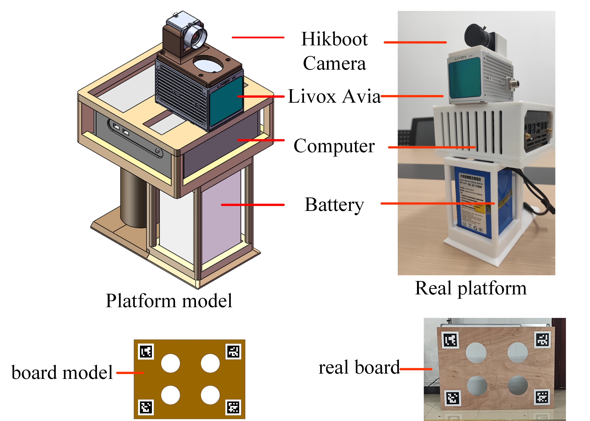

# OTPS-Calib
**OTPS-Calib** is target-based extrinsic calibration method for the non-repetitive LiDAR(NRL) and RGB camera. This method use a known four-hole calibration board as the target. It mainly include two modules: (1) the LiDAR module, and (2) the camera module. The first mudule is specially designed for the NRL, the main process is reconstruct the boundary points of the detected target point cloud, to increase the accuracy of the hole center detection. The second module proposes a new method to get better corner estimation of the ArUco markers, therefore better hole center extraction for board pose estimation. It achieves high accuracy with just one target, one pose, and one shot. The source code will be release after the acceptance.
## Overview
<div align="center">
    <br>
    <font color=#a0a0a0 size=4> The framework of the OTPS-Calib</font>
</div>

## colorlized Point cloud  example
<div align="center">
    <br>
    <font color=#a0a0a0 size=4>Our experimental platform</font>
</div>
<div align="center">
    <br>
    <font color=#a0a0a0 size=4>An example of a indoor calibration scenario. We color the point cloud with the calibrated extrinsic and compare with existing methods. For more information, please refer to our paper when it has been accpeted</font>
</div>

## 1. Prerequisites
### 1.1 **Ubuntu** and **ROS**
Ubuntu 20.04.
ROS noetic.

```
    sudo apt-get install ros-XXX-cv-bridge ros-xxx-pcl-conversions
```

### 1.2 **Eigen**
Follow [Eigen Installation](http://eigen.tuxfamily.org/index.php?title=Main_Page)

### 1.3 **Ceres Solver**
Follow [Ceres Installation](http://ceres-solver.org/installation.html).

### 1.4 **PCL**
Follow [PCL Installation](http://www.pointclouds.org/downloads/linux.html). (Our code is tested with PCL1.10)

### 1.5 **OpenCV**
OpenCV 4.5.3

## 2. Build
Clone the repository and catkin_make:

```
cd ~/catkin_ws/src
git clone https://github.com/tdcsu1998/OTPS_calib.git
cd ../
catkin_make
source ~/catkin_ws/devel/setup.bash
```

## 3. Run our example
The exmaple dataset will be released after the paper has been acepted.

## 4. Thanks
Our code is developed part from the [velo2cam](https://github.com/beltransen/velo2cam_calibration) and the [lvt2calib](https://github.com/beltransen/velo2cam_calibration).